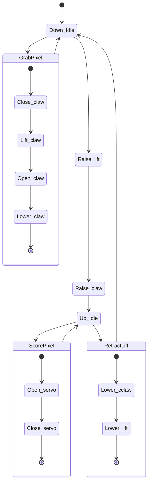

# 2023-2024 Code

This is the repository for the RHS 2023-2024 season's code.

## Architecture

The code is split up into several different classes representing the different
hardware components.

- Airplane launcher
- Arm
- Gamepad
- Drivetrain
- Intake

Each of these classes contains the logic controlling each component.

## Scoring Table

| Period  | Achievement                                   | Points          |
| ------- | --------------------------------------------- | --------------- |
| Auto    | Parking in backstage                          | 5               |
| Auto    | Pixel on backdrop                             | 5               |
| Auto    | Pixel in backstage                            | 3               |
| Auto    | Purple pixel on spike mark                    | 10 or 20        |
| Auto    | Yellow pixel on the backdrop in correct place | 10 or 20        |
| Teleop  | Pixel in backstage                            | 1               |
| Teleop  | Pixel on backdrop                             |                 |
| Teleop  | Completed mosaic                              | 10              |
| Teleop  | Cross set line                                | 10              |
| Endgame | Hang from rigging                             | 20              |
| Endgame | Park in backstage                             | 5               |
| Endgame | Drone launched                                | 30 or 20 or 10  |
|         | Minor Penalty                                 | 10 (other team) |
|         | Major Penalty                                 | 30 (other team) |

## State Machine Diagram

